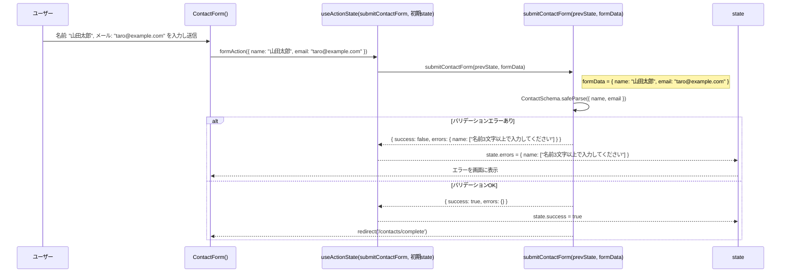

```mermaid
sequenceDiagram
    participant User as ユーザー
    participant Form as ContactForm()
    participant useActionState as useActionState(submitContactForm, 初期state)
    participant submitContactForm as submitContactForm(prevState, formData)
    participant State as state

    User->>Form: 名前: "山田太郎", メール: "taro@example.com" を入力し送信
    Form->>useActionState: formAction({ name: "山田太郎", email: "taro@example.com" })
    useActionState->>submitContactForm: submitContactForm(prevState, formData)
    Note right of submitContactForm: formData = { name: "山田太郎", email: "taro@example.com" }
    submitContactForm->>submitContactForm: ContactSchema.safeParse({ name, email })
    alt バリデーションエラーあり
        submitContactForm-->>useActionState: { success: false, errors: { name: ["名前3文字以上で入力してください"] } }
        useActionState-->>State: state.errors = { name: ["名前3文字以上で入力してください"] }
        State-->>Form: エラーを画面に表示
    else バリデーションOK
        submitContactForm-->>useActionState: { success: true, errors: {} }
        useActionState-->>State: state.success = true
        submitContactForm-->>Form: redirect('/contacts/complete')
    end
```