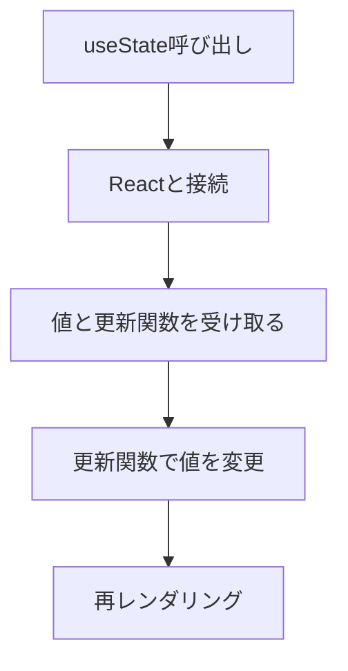

# 画面が変更されるために必要な処理
- Reactにコンポーネントの再実行（再レンダリング）を依頼
- 新しいReact用を作成してもらう
- 変更↓値をどこかに保存しておく必要がる（stateに保存）
→これを可能にする仕組みがuseStateという関数！！

----------------------

# useStateの役割と使い方
1. 接続（Hook into）
React内部と接続。状態が管理されるようになる
2. 「現在の値」と「更新関数」を返却
3. 更新関数で新しい値をReactに渡す
4. Reactに自身のコンポーネントを再実行するように依頼



----------------------

# State(状態)とは？
コンポーネントごとに保持・管理される値
  ※コンポーネント内に定義した普通の変数はレンダリングのたびに初期化され保持されない！

----------------------

# UseActionStateとは？
## 概要
- ServerActionの実行結果（成功/エラー）の状態管理が可能
- サーバサイドでバリデーションエラーの表示
- サーバサイドの処理中の状態管理

まとめると、「フォームアクションの結果に基づいてstateを更新するためのフック」

```ts
import {useActionState} from 'react'
const [state, formAction, isPending] = useActionState(fn, initialState, permalink?)
```

## 引数
- state: フォームが最後に送信されたときにアクションによって返される値
  - フォームが送信されていない場合は、渡された初期stateが使われる

- fn: フォームが送信されたりボタンが押されたりしたときに呼び出される関数。この関数が呼び出される際には、１番目の引数としてはフォームの前回stateを受け取り、次の引数としてフォームアクションが通常受け取る引数を受け取る。
```ts
export async function submitContactForm(
    prevState: ActionState, // state
    formData: FormData      // てフォームアクションが通常受け取る引数
): Promise<ActionState> {
    const name = formData.get('name')
    const email = formData.get('email')
...
```

## 返り値
1. 現在のstate
  - 初回レンダー時には、渡したinitialStateと等しくなる
  - アクションが呼び出されたとあとは、そのアクションが返した値になる


## 参考文献
https://ja.react.dev/reference/react/useActionState#useactionstate

----------------------

# PrismaClientのインポートエラーについて
- 以下のエラーが発生
```
    ⨯ Error: @prisma/client did not initialize yet. Please run "prisma generate" and try to import it again.
    at eval (src\lib\prisma.ts:8:48)
    at (action-browser)/./src/lib/prisma.ts (C:\Users\kento\nextjs-udemy.next\server\app\contacts\page.js:44:1)
    at webpack_require (C:\Users\kento\nextjs-udemy.next\server\webpack-runtime.js:33:42)
    at eval (webpack-internal:///(action-browser)/./src/lib/actions/contact.ts:10:69)
    at (action-browser)/./src/lib/actions/contact.ts (C:\Users\kento\nextjs-udemy.next\server\app\contacts\page.js:33:1)
    at webpack_require (C:\Users\kento\nextjs-udemy.next\server\webpack-runtime.js:33:42)
    at (action-browser)/./node_modules/next/dist/build/webpack/loaders/next-flight-action-entry-loader.js?actions=%5B%5B%22C%3A%5C%5CUsers%5C%5Ckento%5C%5Cnextjs-udemy%5C%5Csrc%5C%5Clib%5C%5Cactions%5C%5Ccontact.ts%22%2C%5B%7B%22id%22%3A%226086139e1a5b2eb0e44a029744af2e66d90ca40484%22%2C%22exportedName%22%3A%22submitContactForm%22%7D%5D%5D%5D&client_imported=true! (C:\Users\kento\nextjs-udemy.next\server\app\contacts\page.js:22:1)
    at Object.webpack_require [as require] (C:\Users\kento\nextjs-udemy.next\server\webpack-runtime.js:33:42)
    6 | }
    7 | // Prismaインスタンスがあれば使う、無ければ作成

    8 | export const prisma = globalForPrisma.prisma ?? new PrismaClient()
    | ^
    9 | // 開発環境でのみ使用
    10 | if (process.env.NODE_ENV !== 'production') globalForPrisma.prisma = prisma {
    digest: '71714467'
```

- `prisma generate`を実行して再度リロードやビルドしても同じエラーになっていた
  - 原因は`prisma/shema.prisma`にて、以下の記述になっていたから
```
    generator client {
    provider = "prisma-client-js"
    output   = "../src/generated/prisma" →　ここ！
    }   
```

- provider = "prisma-client-js"
→ Prisma Client（TypeScript/JavaScript用のDBクライアント）を生成する指定

- output = "../src/generated/prisma"
→ 生成されたPrisma Clientのコードを「プロジェクトのsrc/generated/prisma」フォルダに出力する、という意味

- 対応策
  1. `schema.prisma`の`output`の設定を削除
    → `import { PrismaClient } from '@prisma/client';`でOK
  2. `import { PrismaClient } from '../generated/prisma';`などのように、outputの出力先からimportするようにする

 --------------
 # useEffectとは？
 ✅ useEffectの実行タイミングまとめ
🟢 初回レンダリング時
```js
useEffect(() => {
  // ✅ これは実行される（初回実行）
  connect();
  return () => {
    // ⛔ これは実行されない（まだクリーンアップの必要がない）
    disconnect();
  };
}, [依存値]);
```

🔁 依存値が変更されたとき（2回目以降）
```js
// この順番で動く！

1. 🔁 前回のuseEffectの return関数（クリーンアップ）が呼ばれる
   → disconnect()

2. 🔁 今回の useEffect の中身が実行される
   → connect()
```
❌ 依存値に変化がなければ、useEffectは再実行されない

🎯 図で見るとこんな感じ

```plaintext
1回目（初回マウント時）：
┌─────────────────────┐
│ connect()           │ ← 実行される
│ return disconnect() │ ← 実行されない
└─────────────────────┘

2回目（依存値が変化）：
┌─────────────────────┐
│ disconnect()         │ ← 1回目の return が実行される
│ connect()            │ ← 今回の useEffect 本体が実行される
│ return disconnect()  │ ← 次回のためにセット
└─────────────────────┘
✅ 補足ポイント
状況	useEffect 本体	return 関数
初回マウント時	✅ 実行される	⛔ 実行されない
依存値が変わった時	✅ 実行される	✅ 前回のが実行
アンマウント時	⛔ 実行されない	✅ 最後のが実行
```

「2回目以降はreturnの中身から始まって本体が実行される」という感覚
