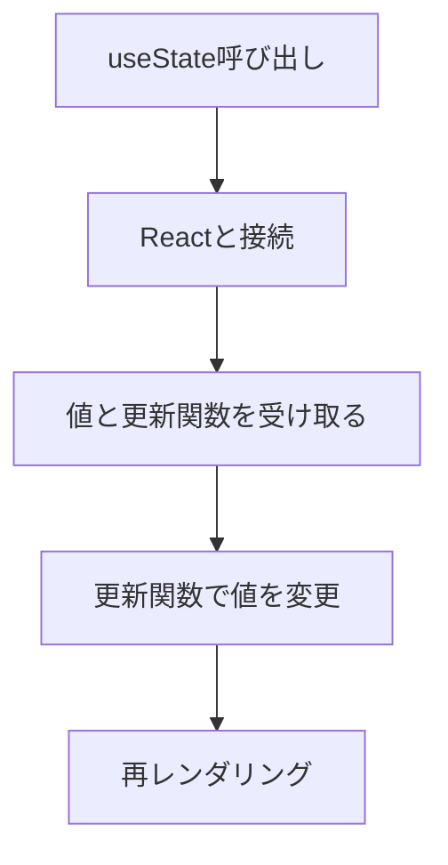

# 画面が変更されるために必要な処理
- Reactにコンポーネントの再実行（再レンダリング）を依頼
- 新しいReact用を作成してもらう
- 変更↓値をどこかに保存しておく必要がる（stateに保存）
→これを可能にする仕組みがuseStateという関数！！

----------------------

# useStateの役割と使い方
1. 接続（Hook into）
React内部と接続。状態が管理されるようになる
2. 「現在の値」と「更新関数」を返却
3. 更新関数で新しい値をReactに渡す
4. Reactに自身のコンポーネントを再実行するように依頼



----------------------

# State(状態)とは？
コンポーネントごとに保持・管理される値
  ※コンポーネント内に定義した普通の変数はレンダリングのたびに初期化され保持されない！

----------------------

# UseActionStateとは？
## 概要
- ServerActionの実行結果（成功/エラー）の状態管理が可能
- サーバサイドでバリデーションエラーの表示
- サーバサイドの処理中の状態管理

まとめると、「フォームアクションの結果に基づいてstateを更新するためのフック」

```ts
import {useActionState} from 'react'
const [state, formAction, isPending] = useActionState(fn, initialState, permalink?)
```

## 引数
- state: フォームが最後に送信されたときにアクションによって返される値
  - フォームが送信されていない場合は、渡された初期stateが使われる

- fn: フォームが送信されたりボタンが押されたりしたときに呼び出される関数。この関数が呼び出される際には、１番目の引数としてはフォームの前回stateを受け取り、次の引数としてフォームアクションが通常受け取る引数を受け取る。
```ts
export async function submitContactForm(
    prevState: ActionState, // state
    formData: FormData      // てフォームアクションが通常受け取る引数
): Promise<ActionState> {
    const name = formData.get('name')
    const email = formData.get('email')
...
```

## 返り値
1. 現在のstate
  - 初回レンダー時には、渡したinitialStateと等しくなる
  - アクションが呼び出されたとあとは、そのアクションが返した値になる


## 参考文献
https://ja.react.dev/reference/react/useActionState#useactionstate

----------------------

